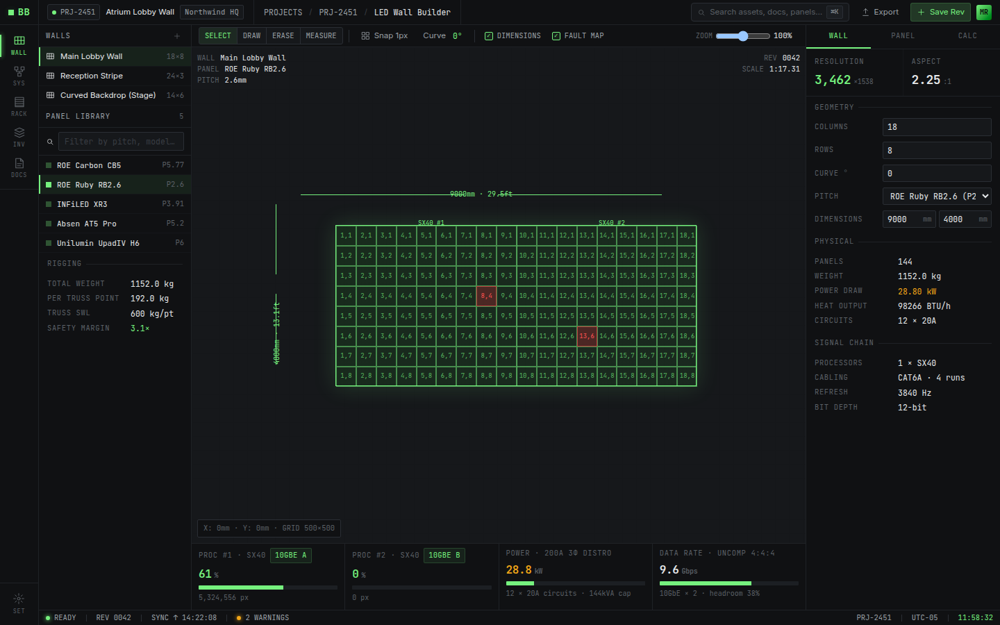
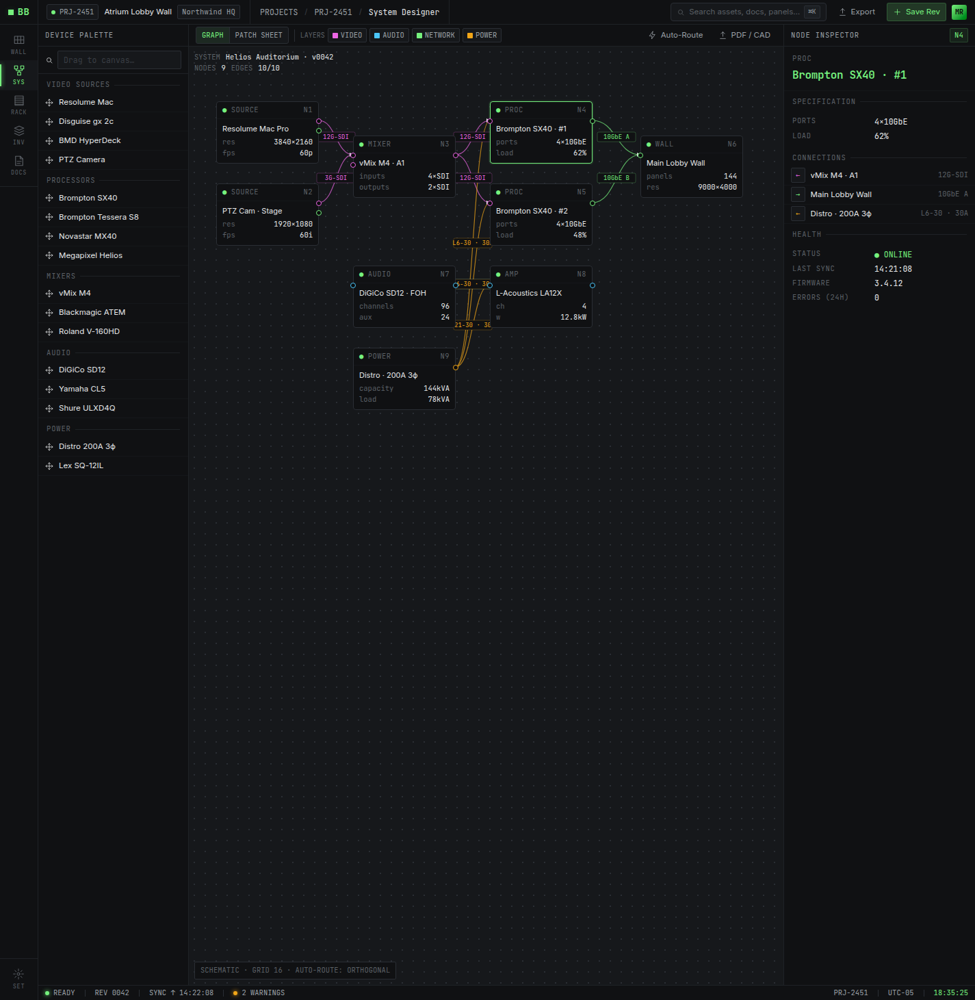
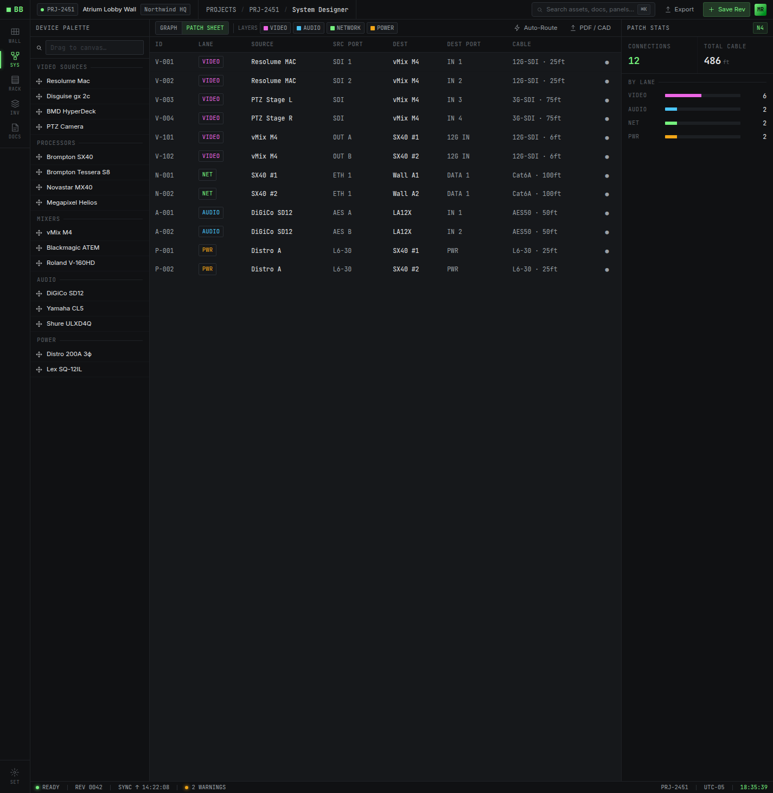
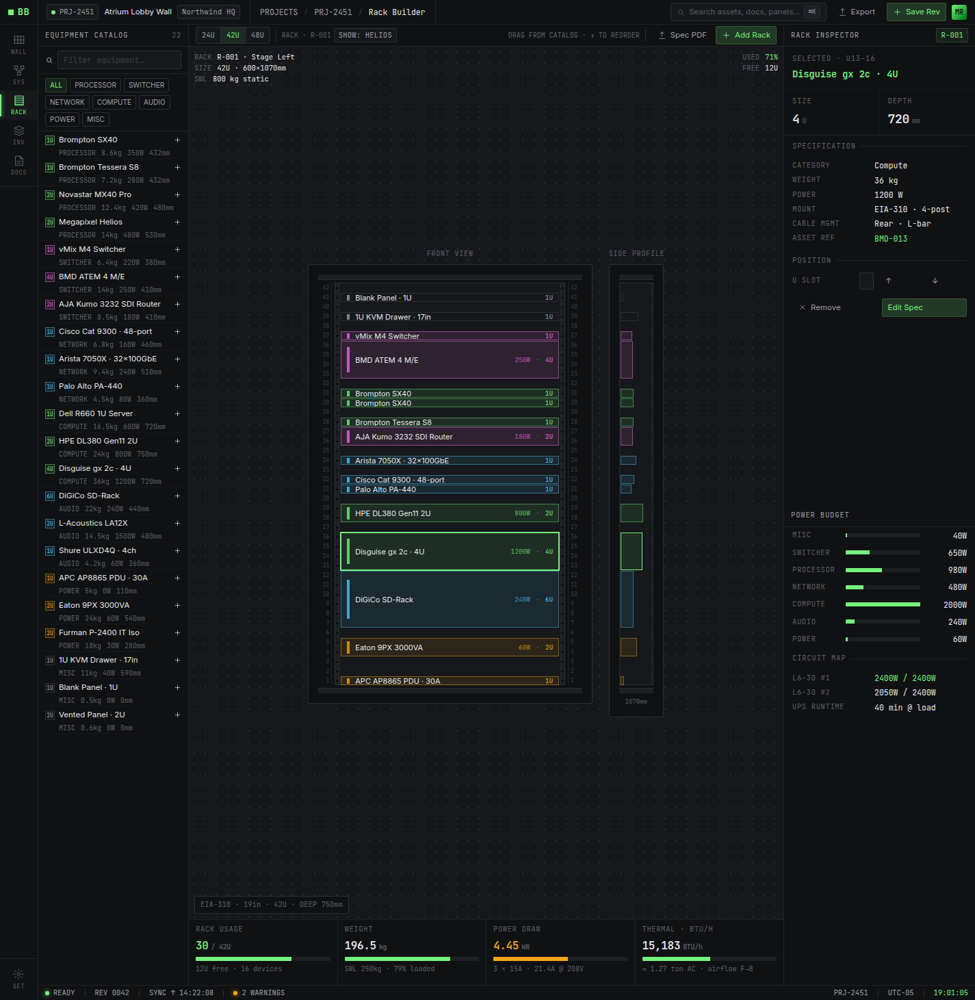
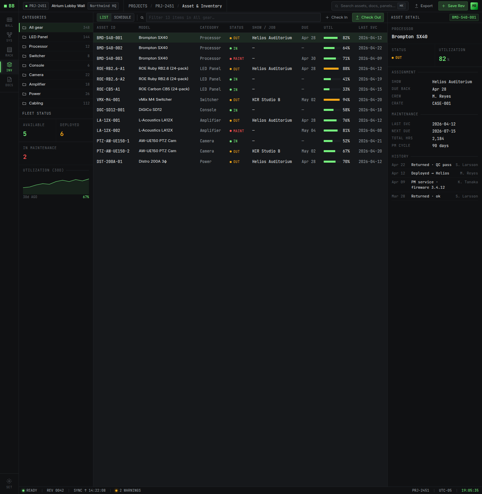
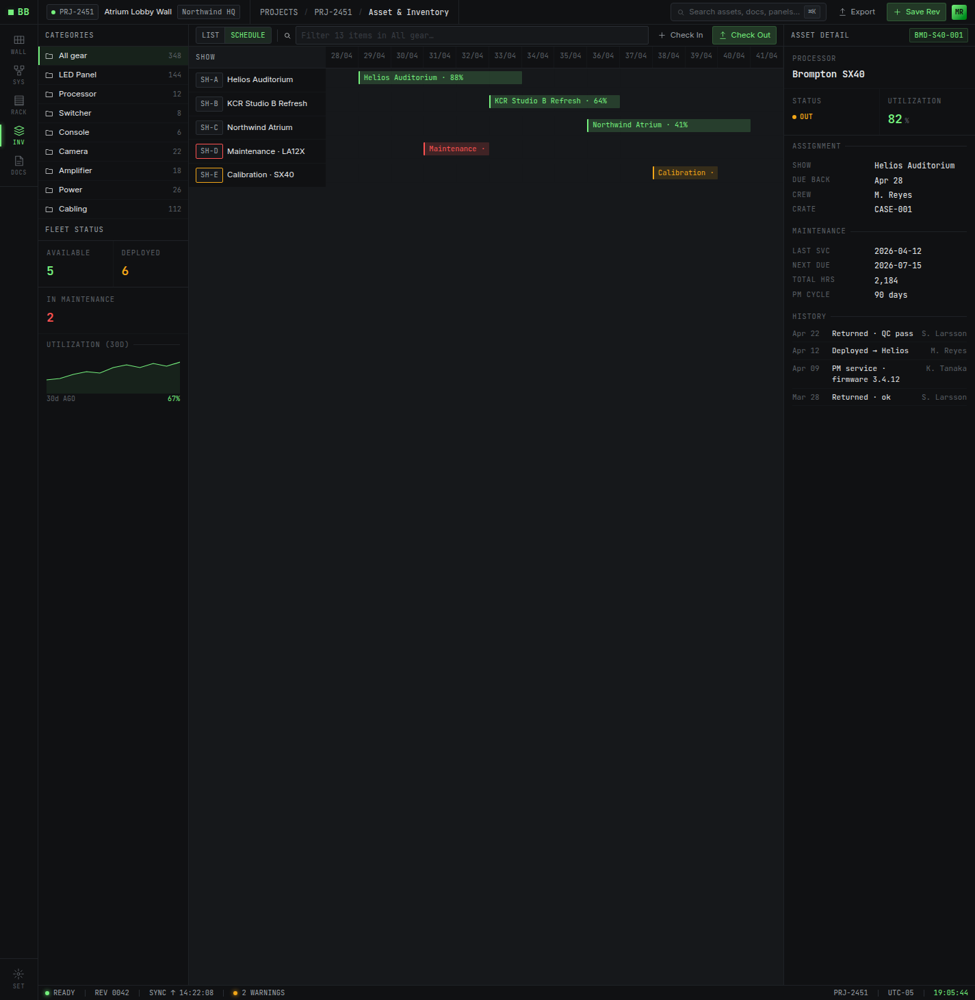
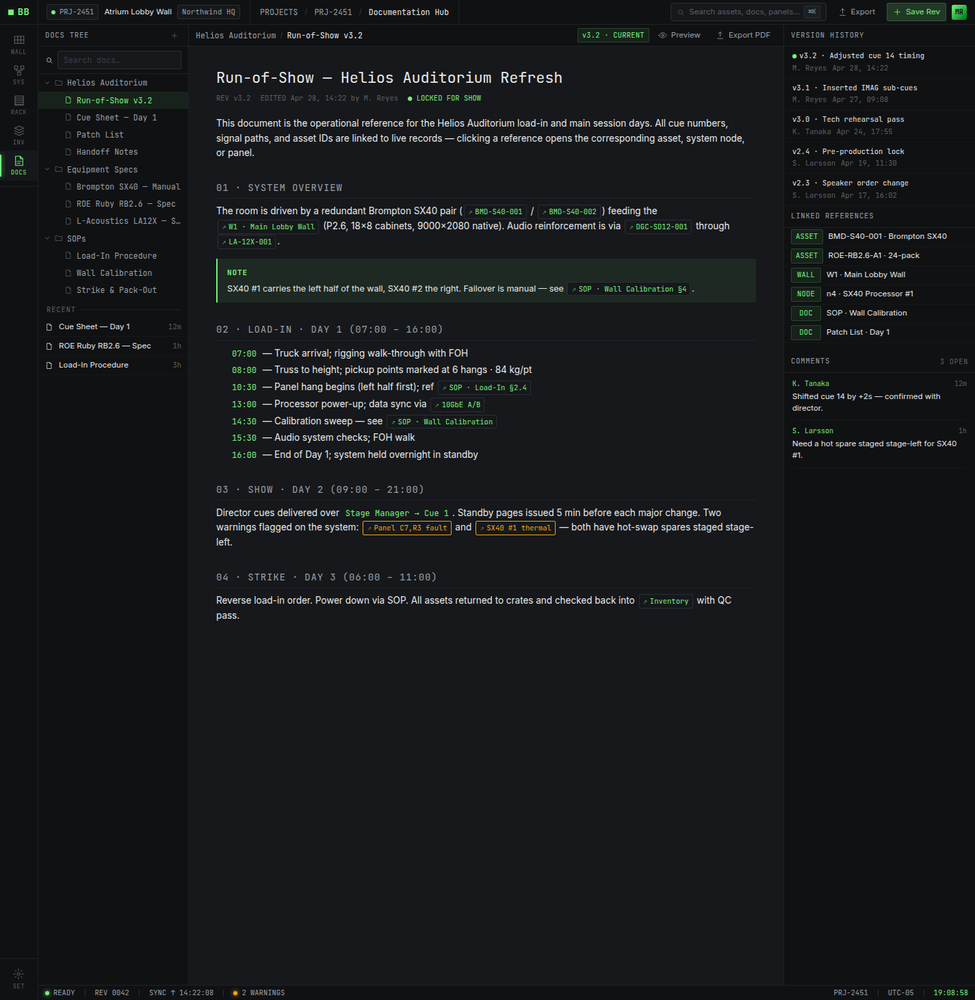

# Blackburst

**AV / live-production design tooling.** Five dense, technical modules behind one keyboard-driven shell (rail · ⌘K command palette · status bar). Runs locally out of the box — every project lives in `localStorage` and exports to a portable JSON snapshot — and wires up to Supabase for accounts, per-user cloud storage, and project sharing.

🔗 **Live demo: https://blackburst.vercel.app**



---

## Modules

### LED Wall Builder
Lay out LED panel walls and get live resolution, pixel count, weight, power draw, processor allocation (Brompton SX40-class, 8.8 Mpx/unit), circuit count, and thermal load (BTU/hr) — all recalculated as you size the wall.

### System Designer
A node graph for video / audio / network / power signal flow, with per-lane visibility toggles and a tabular patch sheet.




### Rack Builder
Drag-to-build 19" racks (24U / 42U / 48U) from a catalog, with running U-usage, weight, power, and circuit totals.



### Asset & Inventory
Fleet table with in / out / maintenance status and utilization, plus a 14-day show-assignment schedule.




### Documentation Hub
File tree with run-of-show / SOP authoring, cross-links to assets and walls, version history, and comments.



---

## Stack

React 18 · TypeScript (strict) · Vite · Zustand · Tailwind v4 · Supabase (optional).

**Local mode (default).** Each project's module state is persisted to `localStorage` and can be exported or imported as a `blackburst-project` JSON file. Switching projects snapshots the live stores and restores the target project's state.

**Accounts mode.** Set the Supabase env vars and the app gates behind magic-link sign-in, stores each project as a JSONB row server-side, and shares projects between users by email with owner / editor / viewer roles — enforced by Postgres row-level security. On first sign-in, projects from this browser can be imported into the account. Setup: [`supabase/README.md`](./supabase/README.md).

## Develop

```bash
npm install
npm run dev        # Vite dev server on :5173 (exposed on the LAN)
npm run build      # tsc -b && vite build
npm run typecheck  # tsc -b --noEmit
npm run preview    # serve the production build
```

The strict TypeScript compiler is the only static gate (no separate linter): `npm run build` fails on unused vars, dead code, and type errors.

## Deployment

Deployed on [Vercel](https://vercel.com): importing the GitHub repo auto-detects the Vite preset and, on every push to `main`, runs `npm run build` and serves `dist` from Vercel's CDN — with preview deployments for each pull request. Build settings are pinned in [`vercel.json`](./vercel.json). For accounts mode, set `VITE_SUPABASE_URL` and `VITE_SUPABASE_ANON_KEY` in the Vercel project's environment variables.
